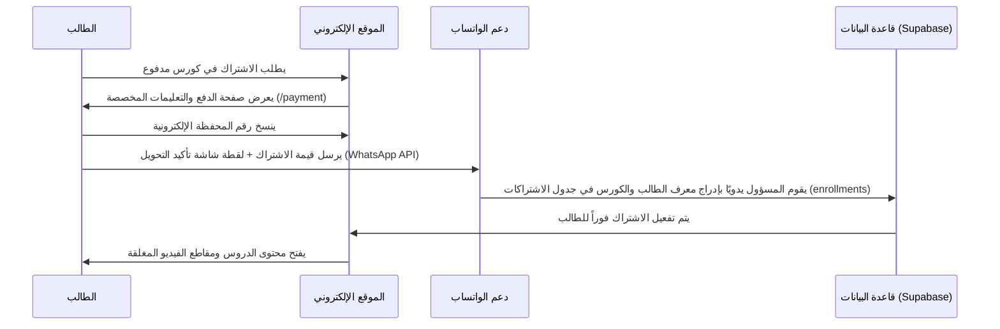

# ماذا يقدم الموقع وكيف يعمل (What the Website Does & How it Works)

هذا الملف يشرح الغرض من منصة أحمد سعد التعليمية للأحياء وكيفية عملها تقنياً ووظيفياً من البداية وحتى تتبع تقدم الطالب.

---

## 🎯 الغرض والوظيفة الأساسية (Core Value & Features)

منصة أحمد سعد لتعليم الأحياء هي موقع تعليمي متطور مخصص لطلاب المرحلة الثانوية (الصفوف الأول والثاني والثالث الثانوي) في مدينة بسيون وما حولها. 

**المهام والخدمات الرئيسية:**
1. **تصنيف المنهج الدراسي:** تنظيم الحصص والدورات التعليمية (الكورسات) بناءً على الصف الدراسي للطالب.
2. **مشاهدة المحاضرات وحماية المحتوى:** توفير واجهة تعليمية تفاعلية لعرض الشروحات مع تطبيق تدابير حماية قوية لمنع سرقة أو تحميل الفيديوهات.
3. **تتبع التقدم الدراسي:** معرفة الدروس المكتملة وعرض نسبة إنجاز الطالب داخل كل كورس.
4. **التنافس والتحفيز (ذاكر واكسب):** تحفيز الأوائل المتفوقين عبر مسابقات وجوائز دورية.

---

## ⚙️ دورة العمل والوظائف البرمجية (System Workflows)

### 1. التسجيل والتحقق من الهوية (Authentication & Profile)
* يسجل الطالب عبر صفحة التسجيل (`/register`) حيث يُدخل: اسمه الكامل، البريد الإلكتروني، رقم الهاتف، والصف الدراسي الخاص به.
* يتم ربط هوية المستخدم بجدول السنوات الدراسية (`years`)، وبناءً عليه يتم تصفية وعرض محتوى الكورسات المناسب لصفه الدراسي فقط بشكل تلقائي.

### 2. تدفق شراء الكورسات وتأكيد الدفع (Manual Enrollment Workflow)
بما أن الدفع الإلكتروني المباشر قد لا يكون متاحاً لجميع الطلاب، تعتمد المنصة على نموذج دفع يدوي هجين وآمن عبر المحافظ الإلكترونية كالتالي:

---

### 3. تتبع تقدم الطالب (Progress Tracking)
تتميز المنصة بنظام تتبع تقدم ذكي مزدوج المزامنة (Dual Sync Mechanism):
* **المشاهدة التلقائية:** عند مشاهدة الطالب لـ **90%** أو أكثر من فيديو الدرس، يتم وضع علامة "مكتمل" تلقائياً دون تدخل من الطالب.
* **التحديد اليدوي:** يمكن للطالب تحديد الدرس كمكتمل يدوياً من واجهة التعلم.
* **المزامنة الثنائية:** لحماية تجربة الاستخدام من بطء الاستجابة أو انقطاع الإنترنت، يتم تخزين تقدم الطالب أولاً في الذاكرة المحلية للمتصفح (`localStorage`) بشكل لحظي، ثم يتم إرسال طلب التحديث لقاعدة البيانات (Supabase) في الخلفية عبر Next.js Server Actions.

---

## 🗄️ هيكل البيانات (Database Schema Structure)

تتكون قاعدة بيانات المشروع في Supabase من 6 جداول رئيسية مترابطة كالتالي:

1. **`years` (الصفوف الدراسية):** يحتوي على الصفوف (الأول، الثاني، الثالث الثانوي) ومؤشر ترتيبهم.
2. **`profiles` (حسابات الطلاب):** يربط الحساب الأساسي بـ UUID الخاص بـ Supabase Auth، ويحفظ بيانات الاسم، الهاتف، ومستوى الصف الدراسي الحالي.
3. **`courses` (الكورسات):** يحتوي على عنوان الكورس، الوصف، رابط غلاف الكورس، السعر، وحالة النشر. يتبع لـ `year_id` محدد.
4. **`lessons` (الدروس):** تتبع لكورس معين وتضم مقطع الفيديو، المحتوى النصي، والترتيب التصاعدي للدرس.
5. **`enrollments` (الاشتراكات):** يربط الطلاب بالكورسات التي قاموا بشرائها. يمنع هذا الجدول الوصول للدروس المدفوعة ما لم تكن هناك علاقة اشتراك صالحة.
6. **`lesson_progress` (تقدم الدروس):** يسجل الدروس المكتملة لكل طالب لمتابعة تقدمه الدراسي أولاً بأول.

---

## 🔒 حماية أمن المحتوى (Content Protection)
تطبق المنصة مستويات أمنية لحماية الفيديوهات التعليمية الخاصة بالاستاذ أحمد سعد من التسريب:
1. **تشفير روابط التشغيل (Base64 Encryption):** لا تظهر روابط Vimeo أو YouTube أو الروابط المباشرة بصورتها الخام في الكود البرمجي (Inspect Source)، بل يتم تشفيرها وإرسالها من السيرفر كأكواد مشفرة ليفك المتصفح تشفيرها وقت التشغيل فقط.
2. **منع أدوات الفحص وتصوير الشاشة:**
   * يتم تعطيل الزر الأيمن للفأرة (`contextmenu`).
   * يتم حظر الاختصارات المخصصة لفتح أدوات المطورين في المتصفح مثل زر `F12` و `Ctrl+Shift+I` و `Ctrl+U`.
   * إضافة طبقة حماية شفافة (Click Blocker Overlay) فوق الفيديو تمنع النقر المباشر عليه أو سحب الرابط منه.

---

# What the Website Does & How it Works (English version)

This file details the target audience, system workflows, database structures, and security configurations of the Ahmed Saad Biology platform.

## 🎯 Primary Purpose
The platform serves high school biology students with course enrollment, custom protected video playback, progress syncing, and student competition rankings.

## ⚙️ Technical Workflows
1. **Registration:** Student profile creation with targeted grade levels (`years`), which isolates student access to their respective curriculum.
2. **Manual WhatsApp Billing Flow:** Free courses are instantly viewable. Paid courses present a detailed payment summary with the mobile wallet number. Students send proof of deposit directly to admin WhatsApp. Admin grants enrollment in the backend database.
3. **Dual Progress Syncing:** Progress updates trigger when a student views 90% of a lesson video or manually checks the completion box. High-availability reads leverage `localStorage` first, and background Next.js Server Actions persist progress to Supabase asynchronously.
4. **Content Shielding:** Prevent video URL extraction via Base64 obfuscation, right-click disabling, and keyboard shortcuts blockades (`F12`, `Ctrl+Shift+I`).
